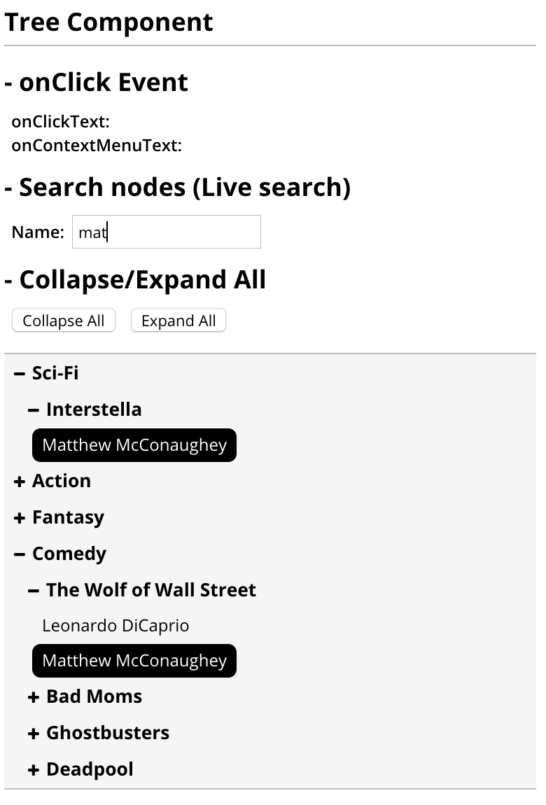

[](https://www.npmjs.com/package/react-tj-treeview) []()
# react-tj-treeview

## Example

```bash
npm install
cd examples && npm install
npm start
```

Then open http://localhost:3000 in a browser.

## Install

```bash
npm install react-tj-treeview
```

## Customize

### CSS

You will need CSS for using this module, customize this.

```sass
$hoverBorderColor: #e0e0e0;

.tree {
  &-root {
    margin: 7px 0;
  }

  ul,
  li {
    list-style: none;
  }

  li {
    margin:      1px 0;
    user-select: none;
  }

  li > label {
    display:       inline-block;
    cursor:        pointer;
    padding:       3px 7px;
    border-radius: 6px;
    border-bottom: 1px solid transparent;

    &:hover {
      border-bottom: 1px solid $hoverBorderColor;
    }

    &:before {
      content: "";
      display: inline-block;
    }

    &.has-children {
      font-size:   110%;
      font-weight: bold;

      &:before {
        font-family:  FontAwesome;
        content:      "\f067";
        font-size:    10px;
        font-weight:  lighter;
        margin-right: 5px;
      }
    }
  }

  input:checked + label.has-children {
    &:before {
      font-family: FontAwesome;
      content:     "\f068";
    }
  }

  input {
    display: none;
  }

  & input + label + ul {
    margin-left: 10px;
  }

  input ~ ul {
    display: none;
  }

  input:checked ~ ul {
    display: block;
  }
}
```

## Screenshot



```json
[{
  "label": "Sci-Fi",
  "children": [{
    "label": "Interstella",
    "children": [{
      "label": "Matthew McConaughey"
    }]
  }]
}, {
  "label": "Action",
  "children": [{
    "label": "Edge of Tomorrow",
    "children": [{
      "label": "Emily Blunt"
    }]
  }]
}, {
  "label": "Fantasy",
  "children": [{
    "label": "Fantastic Beasts and Where to Find Them",
    "children": [{
      "label": "Eddie Redmayne"
    }]
  }, {
    "label": "Miss Peregrine\"s Home for Peculiar Children",
    "children": [{
      "label": "Eva Green"
    }, {
      "label": "Samuel L. Jackson"
    }]
  }, {
    "label": "Star Wars",
    "children": [{
      "label": "Mark Hamill"
    }, {
      "label": "Harrison Ford"
    }, {
      "label": "Felicity Jones"
    }, {
      "label": "Daisy Ridley"
    }, {
      "label": "Mads Mikkelsen"
    }, {
      "label": "Emilia Clarke"
    }]
  }, {
    "label": "Doctor Strange",
    "children": [{
      "label": "Benedict Cumberbatch"
    }, {
      "label": "Rachel McAdams"
    }, {
      "label": "Chiwetel Ejiofor"
    }, {
      "label": "Mads Mikkelsen"
    }]
  }]
}, {
  "label": "Comedy",
  "children": [{
    "label": "The Wolf of Wall Street",
    "children": [{
      "label": "Leonardo DiCaprio"
    }, {
      "label": "Matthew McConaughey"
    }]
  }, {
    "label": "Bad Moms",
    "children": [{
      "label": "Mila Kunis"
    }]
  }, {
    "label": "Ghostbusters",
    "children": [{
      "label": "Kristen Wiig"
    }]
  }, {
    "label": "Deadpool",
    "children": [{
      "label": "Ryan Reynolds"
    }]
  }]
}]
```

## License

MIT, see the [LICENSE](LICENSE) file for detail.
